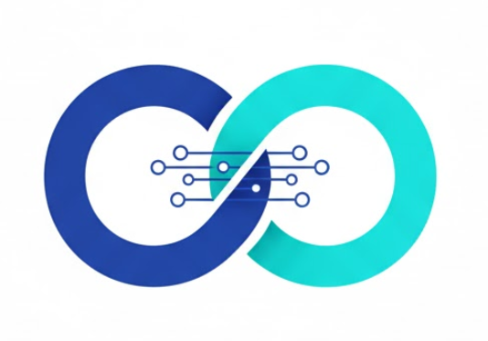

# LinkEdu（智联）——师生协同的 AI 全场景教育生态引擎
L - Linking (连接教材与学生)

I - Interactive (交互式学习体验)

N - Next-gen (下一代 AI 备课方案)

K - Knowledge (知识的深度转化)

**师生协同的 AI 全场景教育生态引擎**


标志设计 (The Icon)



构型：采用双向链接 (Interlocking Link) 结构。
寓意：左侧圆环代表“教师的教学导向”，右侧代表“学生的自主学习”，交织点象征 AI 实时连接教材与课堂，实现“灵动学习，刻骨铭心”。


教师端与学生端核心功能均已实现，支持备课、授课与学习全流程。

- **技术文档（面试向）**：实现细节、各功能技术方案与项目结构说明见 [knowledge.md](knowledge.md)，便于应对项目细节拷打。

---

## 当前状态

- **教师端**：对话、文件库、bilibili视频备课、教案、教学幻灯片、教学视频、测验、试卷、教学记录汇 已全部打通
- **学生端**：对话、智能笔记、测验、播客、知识卡片、错题本、学习记录汇、英语口语、学习袋、B站视频学习 等已实现
- **账户体系**：已支持学生端 / 教师端登录注册、退出登录、修改密码、注销账户与未登录拦截
- **数据隔离**：已取消“所有用户共享全局历史”的旧逻辑，改为按账户隔离查看与操作自己的数据
- **前端**：Vue 3 + Vite + TypeScript + TailwindCSS
- **后端**：Python FastAPI（`backend/`）
- **适用对象**：教师、学生、教研团队的本地化 AI 教学与学习平台

---

## 账户系统与数据隔离

### 入口与使用方式

- 点击首页的**学生端**或**教师端**后，会先进入统一的账户登录 / 注册页面
- 登录成功后，系统会按入口角色跳转到对应工作区
- 未登录状态下访问学生端或教师端业务页，会被自动重定向到 `/auth`

### 当前支持的账户能力

| 功能 | 说明 |
|------|------|
| **注册** | 用户名 + 密码创建本地账户，注册完成后自动登录 |
| **登录** | 用户名 + 密码登录，登录成功后写入本地会话 |
| **退出登录** | 清除当前会话，重新进入受保护页面时需再次登录 |
| **修改密码** | 在“设置 -> 账户设置”中输入旧密码、新密码、确认新密码；修改成功后会强制退出并要求重新登录 |
| **注销账户** | 仅可注销当前登录账户，需要先输入密码并进行二次确认；注销后该账户下的数据会一并删除 |

### 数据库与存储方式

- 账户、登录会话、聊天会话、聊天消息存储在本地 SQLite：`storage/pagelm.sqlite3`
- 用户表负责保存用户名、密码哈希、创建时间等基础信息
- 会话表保存登录 token，用于前端登录态校验
- 对话表与消息表通过 `user_id` 关联，实现每个账户只访问自己的聊天数据
- 其他功能模块在本地存储层同样按 `owner / user_id` 做隔离，避免新账户继承旧账户历史

### 核心隔离规则

- 系统预置管理员账户：`admin1 / admin123`
- `admin1` 会保留项目原有迁移过来的默认历史对话数据，作为默认演示账户
- 新注册普通账户首次登录时，各功能页面默认应为空白状态
- 每个账户只能查看、继续、删除自己的对话、资料和功能历史
- 默认管理员账户 `admin1` 允许修改密码，但不允许注销，避免默认历史数据被误删

### 相关前后端实现位置

- 前端认证页：[frontend/src/pages/AuthPortal.vue](frontend/src/pages/AuthPortal.vue)
- 前端账户设置弹窗：[frontend/src/components/AccountSettingsModal.vue](frontend/src/components/AccountSettingsModal.vue)
- 前端登录态管理：[frontend/src/stores/auth.ts](frontend/src/stores/auth.ts)
- 前端路由守卫：[frontend/src/router/index.ts](frontend/src/router/index.ts)
- 后端认证接口：[backend/api/routes/auth.py](backend/api/routes/auth.py)
- 后端 SQLite 账户与聊天库：[backend/utils/auth_db.py](backend/utils/auth_db.py)

---

## 核心功能

PageLM 将学习材料与备课资料转换为**交互式资源**，支持测验、闪卡、笔记、播客、教案、幻灯片与视频等，利用 LLM 与 TTS 提升教学与学习效率。

### 教师端功能

| 功能 | 说明 |
|------|------|
| **对话** | 围绕备课资料生成教案要点、测验题、板书与课堂互动提问，支持长短回复与多轮对话 |
| **文件库** | 管理备课资料（上传、预览、删除），供对话、教案、幻灯片、视频、测验、试卷等复用 |
| **教案** | 输入课题生成标准教案：三维目标、重难点、教学准备、教学过程、作业设计，可关联备课资料，支持 PDF 导出 |
| **教学幻灯片** | 输入主题生成课程大纲与配图（DeepSeek 大纲 + 即梦 AI 配图），10/15/20 页可选，可基于备课资料，支持导出 PPTX |
| **教学视频** | 输入主题生成讲解脚本与即梦文生视频，Edge TTS 配音并合成有声微课，支持备课资料联动与本地保存 |
| **bilibili视频备课** | 通过 MCP 搜索 B站教学视频，按课题关键词检索并一键跳转视频页用于备课 |
| **测验** | 生成课堂测验题（题干、选项、提示与解析），题型结构清晰、难度可调、题目数量可选，可基于备课资料 |
| **试卷** | 生成多题型试卷（选择、填空、应用题），难度与题型数量可自定义，支持 PDF 导出 |
| **教学记录汇** | 集中查看对话、教案、幻灯片、视频、测验、试卷历史，主题词云与教学趋势图表，左侧为教学记录概览 |

### 学生端功能

| 功能 | 说明 |
|------|------|
| **对话** | 基于学习资料总结、答疑与出题，支持长短回复与多轮对话，对话历史保存 |
| **文件库** | 管理学习资料，供对话、笔记、测验等使用 |
| **智能笔记** | 从主题或上传内容生成康奈尔风格笔记，支持 PDF 导出 |
| **测验** | 生成题目并即时反馈对错与解析，难度与题数可调 |
| **AI 播客** | 将主题或笔记转为对话式音频，TTS 合成，支持本地保存 |
| **知识卡片** | 从主题或资料提取关键概念生成闪卡，便于复习 |
| **错题本** | 收集错题、生成错题报告与巩固练习 |
| **学习记录汇** | 集中查看对话、笔记、播客、测验、卡片历史，主题词云与学习趋势 |
| **英语口语** | 跟读与评测（需配置讯飞等） |
| **学习袋** | 收藏与统计学习内容 |
| **B站视频学习** | 通过 MCP 搜索 B站学习视频，关键词检索并一键跳转视频页学习 |

### 支持的 AI 能力

- **LLM**：Google Gemini、OpenAI、Anthropic Claude、xAI Grok、Ollama（本地）、OpenRouter、DeepSeek 等
- **嵌入**：OpenAI、Gemini、Ollama
- **TTS**：Edge TTS、Google TTS、ElevenLabs（播客与教学视频配音）
- **图像/视频**：即梦（火山引擎）用于幻灯片配图与教学视频画面（需配置相应 API）

---

## 技术栈

| 组件 | 技术方案 |
|------|----------|
| 后端 | Python 3.10+、FastAPI、LangChain、LangGraph |
| 前端 | Vue 3、Vite、TailwindCSS、TypeScript |
| 数据存储 | SQLite（账户、会话、聊天与用户隔离）+ 本地文件 / JSON（功能内容与素材） |
| AI/ML | 多 LLM 提供商、嵌入模型、LangGraph Agent |
| 音频 | Edge TTS、Google TTS、ElevenLabs、FFmpeg |
| 文档 | PyMuPDF、mammoth、python-docx、reportlab、python-pptx |
| 部署 | Docker、Docker Compose（可选） |

---

## 项目结构

### 后端（Python FastAPI）

```
backend/
├── main.py                 # FastAPI 入口
├── config.py               # 配置（Pydantic Settings）
├── api/routes/
│   ├── auth.py             # 注册、登录、登出、修改密码、注销账户
│   ├── chat.py             # 对话（教师/学生）
│   ├── notes.py            # 智能笔记
│   ├── quiz.py             # 测验
│   ├── podcast.py          # 播客
│   ├── flashcards.py       # 闪卡
│   ├── lesson_plan.py      # 教案
│   ├── slides.py           # 教学幻灯片
│   ├── teaching_video.py    # 教学视频
│   ├── paper.py             # 试卷
│   ├── files.py            # 文件上传与管理
│   ├── bilibili.py         # B站视频搜索（MCP Bridge 转发）
│   └── speaking.py         # 英语口语
├── services/
│   ├── mcpManager.js       # MCP Client 管理（stdio 连接 bilibili-mcp-js）
│   └── bilibiliBridgeServer.js # Node Bridge：/api/bilibili/search
├── agents/
│   ├── base.py
│   ├── note_agent.py
│   ├── quiz_agent.py
│   ├── podcast_agent.py
│   ├── lesson_plan_agent.py
│   ├── slides_agent.py
│   ├── teaching_video_agent.py
│   ├── paper_agent.py
│   └── ...
└── utils/
    ├── auth.py             # Bearer Token 解析与登录校验
    ├── auth_db.py          # SQLite 用户、会话、聊天与消息存储
    ├── llm.py
    ├── tts.py
    ├── parser.py
    ├── storage.py
    ├── websocket.py
    └── jiemeng_video.py / jimeng_client.py  # 即梦 配图/视频
```

### 前端

```
frontend/src/
├── pages/
│   ├── AuthPortal.vue      # 学生端 / 教师端统一登录注册页
│   ├── Chat.vue            # 对话（教师 /teacher/chat、学生 /chat）
│   ├── FileLibrary.vue     # 文件库
│   ├── LessonPlan.vue      # 教案
│   ├── Slides.vue          # 教学幻灯片
│   ├── TeachingVideo.vue   # 教学视频
│   ├── Quiz.vue            # 测验（教师 /teacher/quiz、学生 /quiz）
│   ├── Paper.vue           # 试卷（教师）
│   ├── TeachingRecords.vue # 教学记录汇
│   ├── SmartNotes.vue      # 智能笔记
│   ├── Podcast.vue         # 播客
│   ├── KnowledgeCards.vue  # 知识卡片
│   ├── LearningRecords.vue # 学习记录汇
│   ├── WrongBook.vue       # 错题本
│   ├── EnglishSpeaking.vue # 英语口语
│   └── ...
├── components/
│   ├── Chat/               # 对话、Composer、Markdown 等
│   ├── Sidebar.vue         # 导航（按教师/学生角色切换）
│   ├── AccountSettingsModal.vue # 修改密码、注销账户
│   └── ...
├── stores/
│   ├── auth.ts             # 登录态持久化与会话操作
│   └── ...
├── lib/                    # API、工具
└── config/
```

---

## 快速开始

### 环境要求

- Python 3.10+
- Node.js 18+（前端）
- ffmpeg（播客、教学视频音频）
- 可选：即梦/火山引擎 API（幻灯片配图、教学视频画面）

### 启动步骤

```bash
# 克隆项目
git clone <repository-url>
cd PageLM-main

# 后端依赖 差什么包自己pip就行了
pip install -r requirements.txt

# B站 MCP Bridge（Node.js）依赖
cd backend
npm install
cd ..

# 编译 bilibili MCP server（首次或更新后执行）
cd ../bilibili-mcp-js-main
npm install
npm run build
cd ../PageLM-main

# 前端依赖
cd frontend
npm install
cd ..

# 环境配置
cp .env.example .env
# 编辑 .env：配置 LLM、TTS、即梦等密钥与 VITE_BACKEND_URL

# 启动后端（项目根目录或 backend 目录）
cd backend
uvicorn main:app --host 0.0.0.0 --port 5000 --reload

# 新终端启动前端
cd frontend
npm run dev
```

浏览器访问前端地址（如 `http://localhost:5173`）。侧栏可切换**教师** / **学生**角色，分别使用教师端与学生端功能。

首次体验可使用默认管理员账户：

```bash
username: admin1
password: admin123
```

说明：

- `admin1` 保留项目已有的默认历史聊天数据
- 新注册账户默认是空白工作区
- 修改密码后需要重新登录
- 注销账户会删除当前账户及其历史数据，且无法恢复

---

## 配置说明

主要通过 `.env` 配置，关键项示例：

### 服务与前端

```bash
HOST=0.0.0.0
PORT=5000
VITE_BACKEND_URL=http://localhost:5000
VITE_FRONTEND_URL=http://localhost:5173
```

### LLM

```bash
LLM_PROVIDER=gemini    # gemini | openai | claude | grok | ollama | openrouter | deepseek
EMB_PROVIDER=openai
LLM_TEMP=1
LLM_MAXTOK=16384
```

### TTS（播客、教学视频）

```bash
TTS_PROVIDER=edge
TTS_VOICE_EDGE=en-US-AvaNeural
```

### 即梦（幻灯片配图、教学视频）

在 `.env` 中配置火山引擎/即梦相关变量（详见 `.env.example`），未配置则幻灯片可仅生成大纲无配图、教学视频可仅生成脚本与配音。

若教学视频日志出现 `code=50400` 或“没有权限调用即梦AI-视频生成能力”，说明当前 AK/SK 仅具备图像能力或未开通视频能力。可按以下方式处理：

- 在火山引擎控制台为当前账号开通“即梦AI-视频生成”能力；
- 或改用知识点视频生成智能体：在 `.env` 配置 `JIMENG_VIDEO_GATEWAY_API_KEY`，并设置 `JIMENG_VIDEO_PROVIDER=gateway`（或保持 `auto` 但确保 Gateway Key 已配置）。

### Voice Transcription（语音转写）

语音转写建议单独配置转写 provider，不要直接复用指向 DeepSeek 的 `OPENAI_BASE_URL`。
`TRANSCRIPTION_PROVIDER` 与 `TRANSCRIPTION_OPENAI_*` 可单独指定转写模型、密钥与地址。

完整选项见 [.env.example](.env.example)。

### B站 MCP Bridge（视频学习）

```bash
# 可选：Node Bridge 地址（FastAPI 将转发到此地址）
BILIBILI_BRIDGE_URL=http://127.0.0.1:5001

# 可选：Bridge 端口（未设置时默认 5001）
BILIBILI_BRIDGE_PORT=5001

# 可选：bilibili-mcp-js dist 入口路径
BILIBILI_MCP_ENTRY=../bilibili-mcp-js-main/dist/index.js
```

---

## 数据与存储

- **生成内容**：`storage/`
  - `storage/smartnotes/` 笔记 PDF
  - `storage/podcasts/` 播客音频
  - `storage/slides/` 幻灯片与配图
  - `storage/uploads/` 上传文件
  - `storage/json/` JSON 数据库等
- **会话与历史**：由后端 JSON/数据库持久化，对话、教案、测验、试卷等均支持历史查看与复用。

---

## 特性概览

- **双端完整**：教师端备课与授课、学生端学习与练习流程均可用
- **流式输出**：WebSocket 支持对话、笔记、播客等流式生成
- **多模型**：支持多 LLM、多 TTS，可本地 Ollama 部署
- **模块化**：前后端分离，Agent 与路由清晰，便于扩展与二次开发

---

## 技术文档（面试 / 二次开发）

详细的技术实现说明（教师端/学生端各功能实现、所用技术、项目文件夹与主要文件作用、常见面试追问简答）见 **[knowledge.md](knowledge.md)**。

---

## 许可证与贡献

本项目为开源教育平台，教师端与学生端功能均已实现。使用与二次开发请遵循项目所声明的许可证。欢迎提交 Issue 与 Pull Request。
