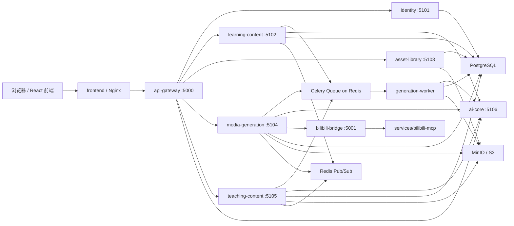

# EduMind（智教）

EduMind 是一个面向教师、学生和教研团队的 AI 教学与学习平台。当前默认运行形态是 Docker Compose 编排的微服务拓扑：源码仍采用 monorepo 管理，前端通过稳定的 API Gateway 访问既有业务路径，后端运行时拆为身份、学习内容、素材库、AI Core、媒体生成、教学内容、异步任务 worker 和 Bilibili Bridge 等服务。新前端已切换为 React + Vite + Tailwind CSS v4 + shadcn/ui 风格的重写实现，旧 Vue 前端保留在 `frontend-legacy/` 作为回退版本。


## 当前状态

- 教师端：对话、文件库、Bilibili 视频备课、教案、幻灯片、教学视频、测验、试卷、教学记录汇已打通。
- 学生端：对话、文件库、智能笔记、测验、播客、知识卡片、错题本、学习记录汇、英语口语、学习袋、B 站视频学习已打通。
- 账户体系：支持学生端 / 教师端登录注册、退出登录、修改密码、注销账户与未登录拦截。
- 数据隔离：账户、会话和业务历史按用户隔离，新注册账户默认为空白工作区。
- 架构形态：Docker Compose 启动 API Gateway、6 个后端边界服务、异步生成 worker、Bilibili Bridge、PostgreSQL、Redis、MinIO 和前端 Nginx。
- 协作方式：GitHub 仓库为 `https://github.com/XXXXXQ-0206/EduMind.git`，分支策略见 [Git/GitHub 协作指南](docs/development/GIT_COLLABORATION.md)。

## 技术栈

| 层级 | 技术 |
|------|------|
| 前端 | React 19、Vite、TypeScript、Zustand、React Router、Tailwind CSS v4、shadcn/ui、Nginx |
| 网关 | FastAPI API Gateway，保持旧 HTTP / WebSocket 路径兼容 |
| 后端服务 | Python 3.11、FastAPI、Pydantic Settings、LangChain / LangGraph |
| AI Core | 集中封装 Gemini、OpenAI、Claude、DeepSeek、OpenRouter、Ollama、Grok 等模型调用 |
| 异步任务 | Celery + Redis 执行长任务、Redis Pub/Sub 事件总线、任务租约、WebSocket/SSE 进度事件 |
| 状态与文件 | PostgreSQL JSONB KV、pgvector、Redis Pub/Sub、MinIO/S3 ObjectStore；JSON / 文件系统仅作为旧数据迁移和本地夹具回退 |
| 媒体能力 | Edge TTS、Google TTS、ElevenLabs、FFmpeg、讯飞 ISE、即梦/火山引擎 |
| Bilibili 能力 | Node.js Bridge + `@modelcontextprotocol/sdk` + `services/bilibili-mcp` |
| 部署 | Docker Desktop / Docker Engine、Docker Compose |

## 微服务拓扑



### 服务边界

| 服务 | 职责 |
|------|------|
| `api-gateway` | 对外暴露兼容旧前端的 API 和 WebSocket 路径，代理到后端服务，并提供 `/health/ready` 聚合健康检查。 |
| `identity` | 用户、会话、登录 token、注册、登录、修改密码、注销和内部 token 解析。 |
| `learning-content` | 学生侧与通用学习工作流：对话、智能笔记、测验、知识卡片、错题本、学习记录、辩论、规划等。 |
| `asset-library` | 文件上传、素材元数据、文件解析、转写入口、RAG 索引和对象存储访问。 |
| `ai-core` | 统一 LLM / Embedding 调用，集中管理模型供应商配置和内部调用接口。 |
| `media-generation` | 播客、英语口语评测、TTS、Bilibili 搜索代理和媒体类供应商调用。 |
| `teaching-content` | 教案、幻灯片、试卷、教学视频和教师侧内容生成。 |
| `generation-worker` | 作为 Celery worker 消费 Redis broker 中的长耗时生成任务，执行失败时按 Celery 策略重试。 |
| `bilibili-bridge` | 独立 Node 服务，连接 `services/bilibili-mcp`，为后端提供 B 站视频搜索能力。 |
| `postgres` / `redis` / `minio` | 微服务共享基础设施：状态、事件、任务队列和对象文件。 |

说明：当前版本已经按服务边界多容器运行，但代码仓库仍是 monorepo，部分 Agent、工具函数和适配器继续共享。后续如果需要更强隔离，可以在现有边界上继续拆包、拆 schema 或拆独立仓库。

更细的边界说明见 [backend-service-boundaries.md](docs/architecture/backend-service-boundaries.md)。

## 项目结构

```text
EduMind/
├── backend/                    # FastAPI 网关、服务应用、业务路由、Agent、基础设施适配器
│   ├── core/                   # app factory、gateway、service registry、task dispatcher
│   ├── infrastructure/         # KV、ObjectStore、EventBus、TaskQueue、TaskLease 适配器
│   ├── api/routes/             # identity / learning / media / teaching 等边界路由
│   ├── agents/                 # 教案、测验、播客、幻灯片、试卷、口语等 LLM Agent
│   ├── services/               # Bilibili Bridge server 与 MCP manager
│   ├── utils/                  # auth、storage、llm、tts、parser、live events、对象工具
│   ├── gateway_app.py          # API Gateway 入口
│   ├── service_app.py          # 单服务边界入口
│   ├── worker_app.py           # 异步 worker 入口
│   └── main.py                 # 本地单进程兼容入口
├── frontend/                   # React + shadcn/ui 前端工程
├── services/bilibili-mcp/      # Bilibili MCP Node 服务
├── deploy/
│   ├── docker/                 # 后端 / 前端 Dockerfile
│   └── nginx.frontend.conf     # 前端 Nginx 配置
├── docs/
│   ├── architecture/           # 架构和服务边界文档
│   ├── deployment/             # 部署与新机器环境配置说明
│   └── development/            # Git/GitHub 协作说明
├── scripts/                    # 启动、迁移、探针和配置脚本
├── tests/backend/              # 后端服务边界、网关、基础设施适配器测试
├── docker-compose.yml          # 当前微服务拓扑
├── setup-edumind-environment.ps1
├── start-edumind.ps1
├── .env.example
└── knowledge.md                # 面试 / 二开技术说明
```

运行时目录 `storage/`、`models/`、`logs/`、`screenshots/` 不进入 Git；Docker Compose 会按需挂载或创建。

## 快速启动

### 1. 新机器环境配置

在 Windows 新机器上，先运行：

```powershell
.\setup-edumind-environment.ps1
```

脚本会检查或安装 Git、Docker Desktop，创建 `.env`，校验 Compose 拓扑，并构建后端与前端镜像。执行完成后检查 `.env`，补入需要的 LLM、TTS、讯飞、即梦等密钥。

只做检查：

```powershell
.\setup-edumind-environment.ps1 -CheckOnly
```

### 2. 启动服务

```powershell
.\start-edumind.ps1
```

`start-edumind.ps1` 默认启动稳定的旧 Vue 前端，并刷新后端和旧前端镜像，避免合并代码后仍运行旧镜像。脚本会打开 Docker Desktop 窗口，结束前显示服务状态和健康检查结果，并等待按 Enter 关闭 PowerShell 窗口。Docker build 会使用缓存，通常不会重复安装全部依赖。

如果要启动 React + shadcn/ui 新前端：

```powershell
.\start-edumind-new-frontend.ps1
```

如果只想复用已有镜像快速拉起：

```powershell
.\start-edumind.ps1 -SkipBuild
.\start-edumind-new-frontend.ps1 -SkipBuild
```

查看关键日志：

```powershell
.\start-edumind.ps1 -Logs
.\start-edumind-new-frontend.ps1 -Logs
```

自动化或不希望弹出 Docker Desktop / 等待输入时：

```powershell
.\start-edumind.ps1 -NoDockerWindow -NoPause
```

启动后访问：

- 前端：[http://localhost](http://localhost)
- API Gateway：[http://localhost:5000](http://localhost:5000)
- Gateway readiness：[http://localhost:5000/health/ready](http://localhost:5000/health/ready)
- MinIO 控制台：[http://localhost:9001](http://localhost:9001)

默认演示账户：

```text
username: admin1
password: admin123
```

### 3. 常用 Docker 命令

```powershell
docker compose ps
docker compose logs -f api-gateway ai-core generation-worker bilibili-bridge
docker compose down
docker compose down -v   # 同时删除 PostgreSQL / MinIO volume，谨慎使用
```

## 配置说明

主要配置文件是 `.env`，模板见 [.env.example](.env.example)。

### 服务与前端

```env
VITE_BACKEND_URL=
VITE_TIMEOUT=90000
```

Docker 前端默认使用同源 Nginx 代理，浏览器只需要访问 `http://localhost`。本地单独运行 `npm run dev` 时，可以临时把 `VITE_BACKEND_URL` 设为 `http://localhost:5000`。

### AI 与模型

```env
LLM_PROVIDER=gemini
EMB_PROVIDER=openai
LLM_TEMP=1
LLM_MAXTOK=16384
LLM_EXECUTION_MODE=remote
AI_CORE_URL=http://ai-core:5106
```

在微服务模式下，业务服务和 worker 默认通过 `ai-core` 调用模型；`ai-core` 自身使用本地 provider 配置。

### 状态、对象与事件

Docker Compose 默认使用：

```env
KV_STORE_PROVIDER=postgres
VECTOR_STORE_PROVIDER=pgvector
PGVECTOR_TABLE=edumind_vectors
OBJECT_STORE_PROVIDER=s3
EVENT_BUS_PROVIDER=redis
TASK_QUEUE_PROVIDER=celery
TASK_LEASE_PROVIDER=redis
```

本地单进程排障仍可临时回退到本地文件 / inline runner；状态和向量数据默认使用 PostgreSQL + pgvector。文件库上传后会自动进入多文件 RAG 索引，agent 调用前会按当前主题或问题检索相关片段。

### 即梦、TTS、讯飞和转写

`.env.example` 中提供了 TTS、即梦/火山引擎、讯飞 ISE、转写 provider 等变量。未配置时，相关功能会降级：幻灯片可只生成大纲，教学视频可只生成脚本或配音前置内容。

## 数据与迁移

- PostgreSQL + pgvector：保存账户/会话、KV JSONB 状态、业务元数据、跨服务共享记录和向量数据。
- Redis：Celery broker/result backend、进度事件、任务租约。
- MinIO/S3：上传文件、PDF、音频、图片、视频等对象。
- Identity 账户库：当前由 `identity` 服务持有并存放在 PostgreSQL；其他服务通过 `/auth/internal/resolve` 解析 token，不直接读取账户表。
- `storage/`：本地开发兼容目录和部分挂载缓存，不应提交 Git。

旧本地 JSON / SQLite / 文件数据可通过启动迁移或迁移脚本迁入当前适配器：

```powershell
python scripts/migrate_storage_to_adapters.py --source-dir storage
python scripts/migrate_storage_to_adapters.py --source-dir storage --write
```

默认是 dry-run，确认报告无误后再加 `--write`。

## 开发与验证

后端基础检查：

```powershell
python -m compileall -q backend scripts tests
python -m pytest tests/backend -q
docker compose config --quiet
```

前端检查：

```powershell
cd frontend
npm ci
npm run lint
npm run build
```

仓库已配置 `.githooks/`，提交前会阻止 `.env`、依赖目录、运行数据、IDE 配置、日志和未走 LFS 的大文件进入 Git，并执行基础质量检查。

## 相关文档

- [knowledge.md](knowledge.md)：架构、模块、关键实现与面试追问。
- [CELERY_REDIS_TASKS_README.md](CELERY_REDIS_TASKS_README.md)：Celery + Redis 长任务、WebSocket/SSE 进度通道说明。
- [backend-service-boundaries.md](docs/architecture/backend-service-boundaries.md)：后端服务边界和当前运行说明。
- [ENVIRONMENT_SETUP_FOR_AGENTS.md](docs/deployment/ENVIRONMENT_SETUP_FOR_AGENTS.md)：新机器环境配置说明。
- [DEPLOY_DOCKER_HUAWEI.md](docs/deployment/DEPLOY_DOCKER_HUAWEI.md)：Docker 部署参考。
- [GIT_COLLABORATION.md](docs/development/GIT_COLLABORATION.md)：GitHub 协作流程。

## 贡献

协作开发请基于 `develop` 创建 `feature/*` 分支，通过 Pull Request 合入。提交前阅读 [Git/GitHub 协作指南](docs/development/GIT_COLLABORATION.md)，不要提交 `.env`、运行数据、日志、依赖目录或个人 IDE / agent 配置。
